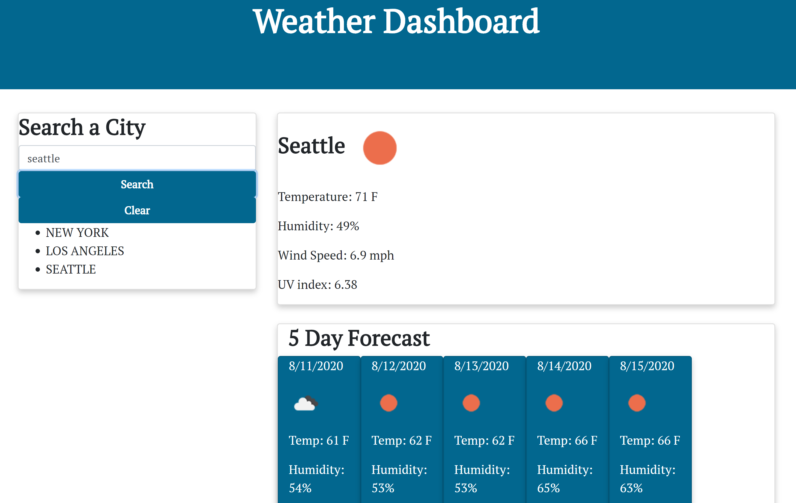

# 06 Server-Side APIs: Weather Dashboard

The Weather Dashboard allows a user to search a city and have weather info about that city displayed. It includes today's forecast, as well as a 5 day forecast. 

## Technologies Used:
HTML5\
CSS3\
Javascript\
OpenWeather API

## Links

## Content Preview

